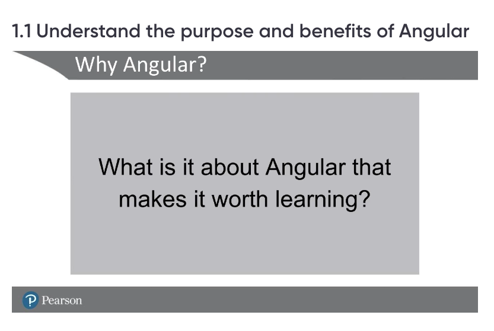
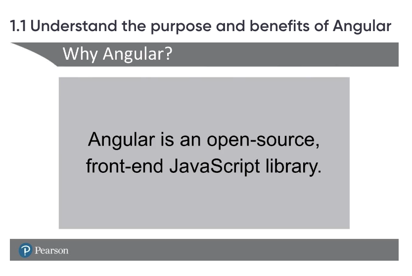
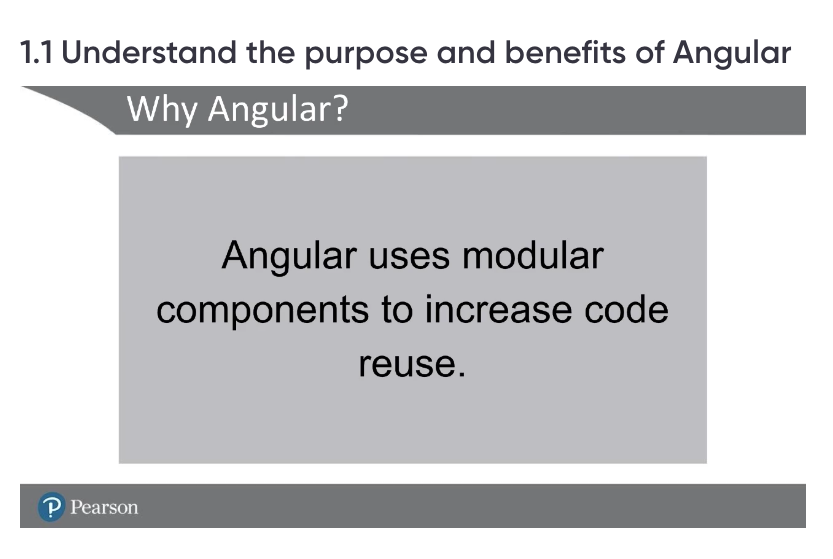
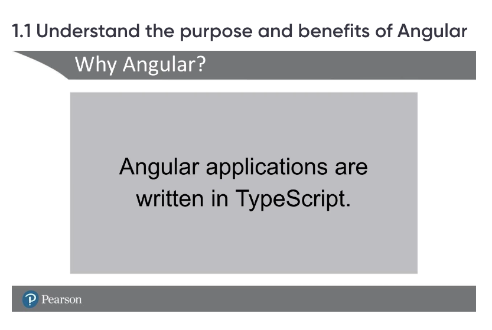
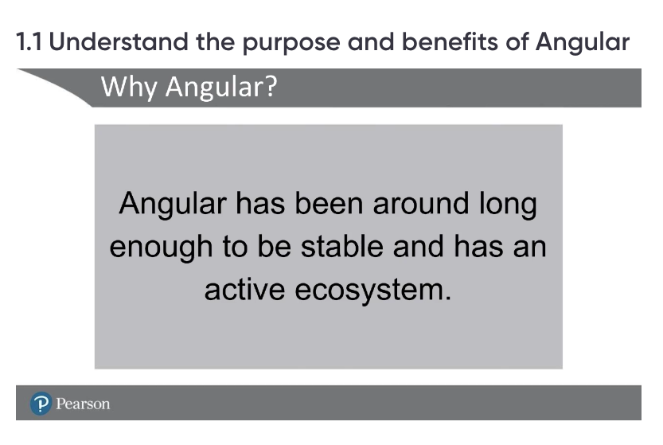
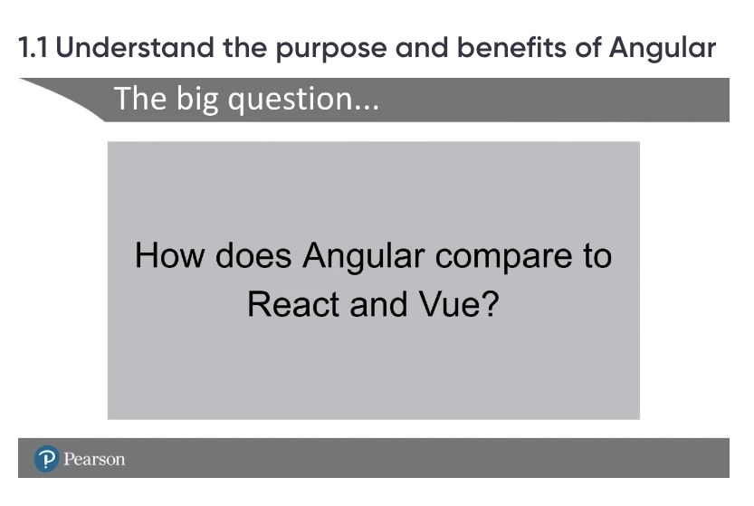
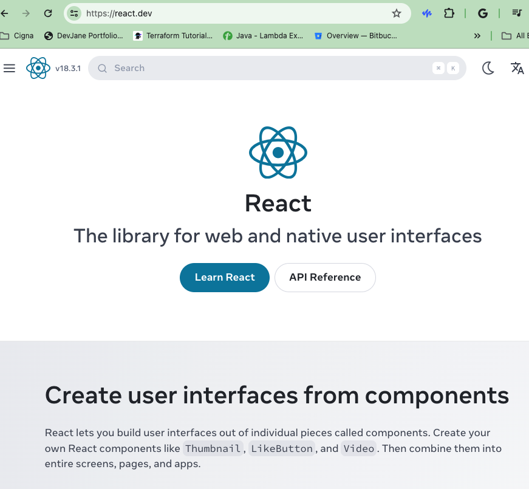
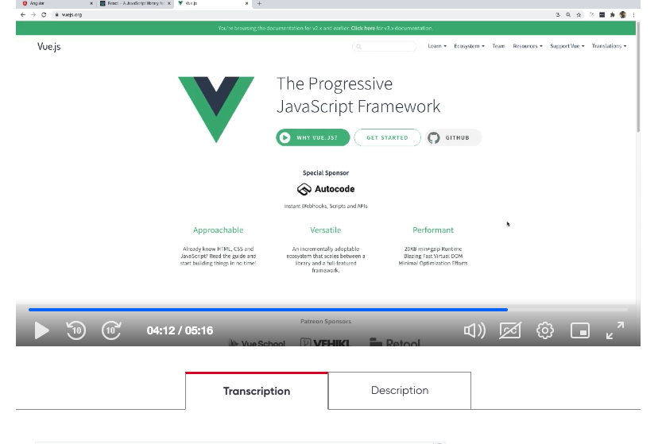

Angular is an open-source front-end JavaScript library.

Angular uses modular Components to increase code reuse

Angular applications are written in TypeScript

Angular is been 2010

Angular vs React vs Vue

Angular Framework 
Enterprise Framework, Mo

React 
More Component Way

Vue
Easy to add to existing web applications- Gradually

