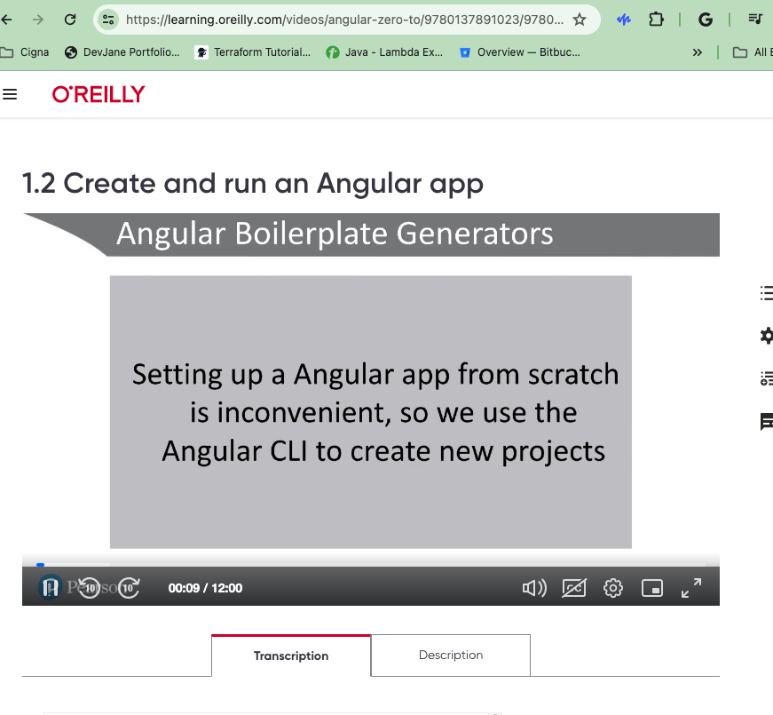
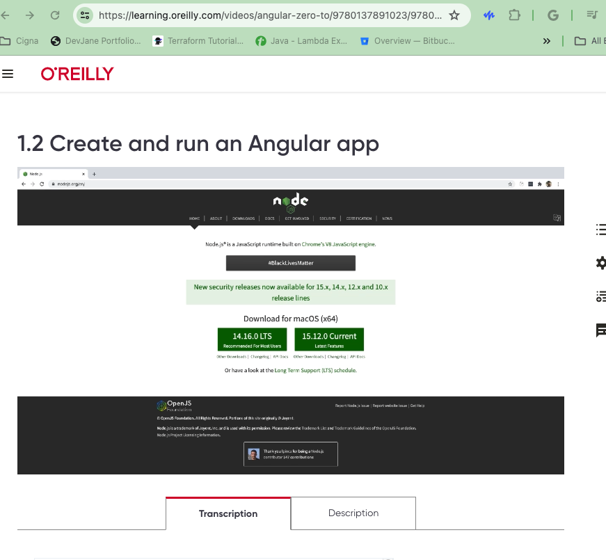
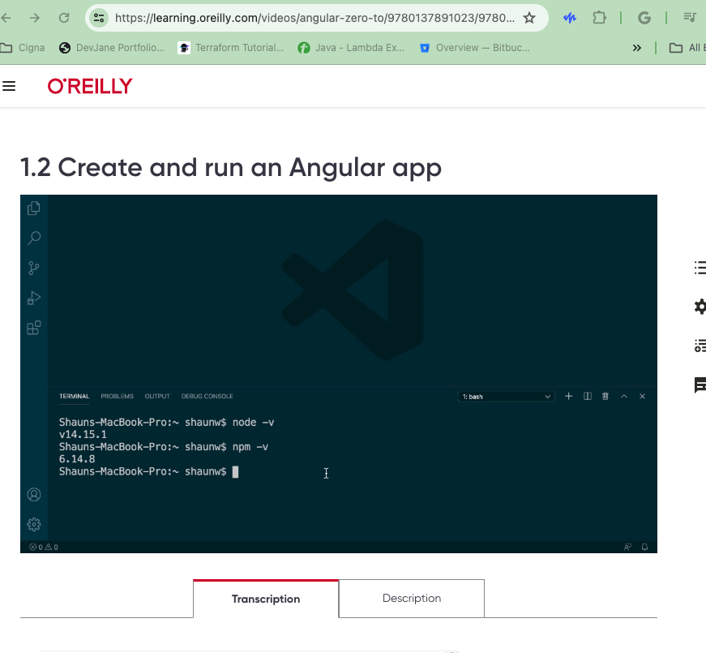
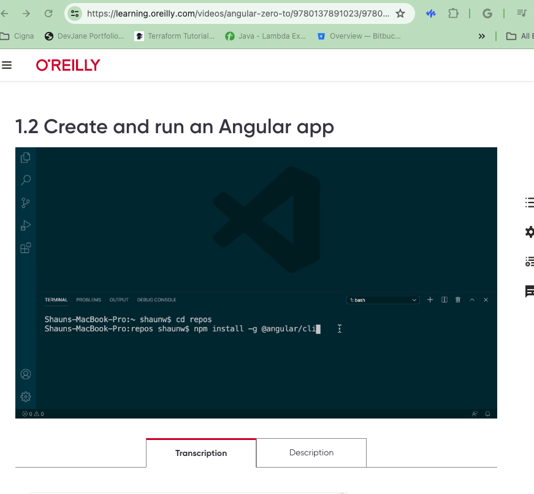
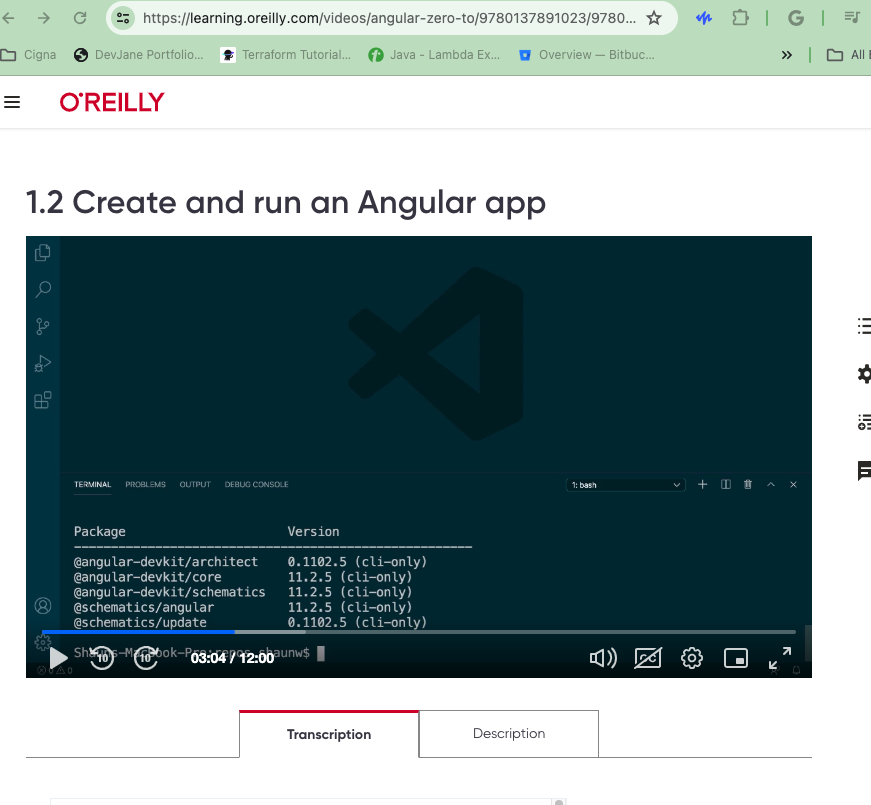
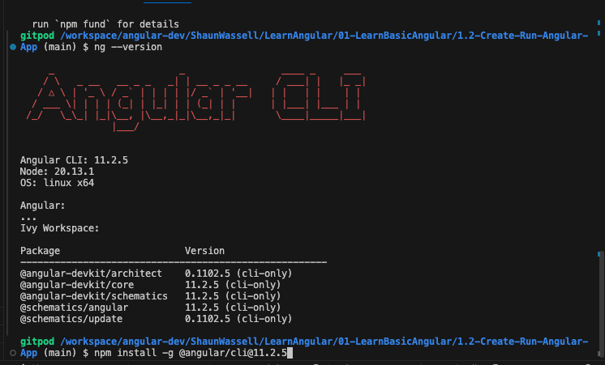
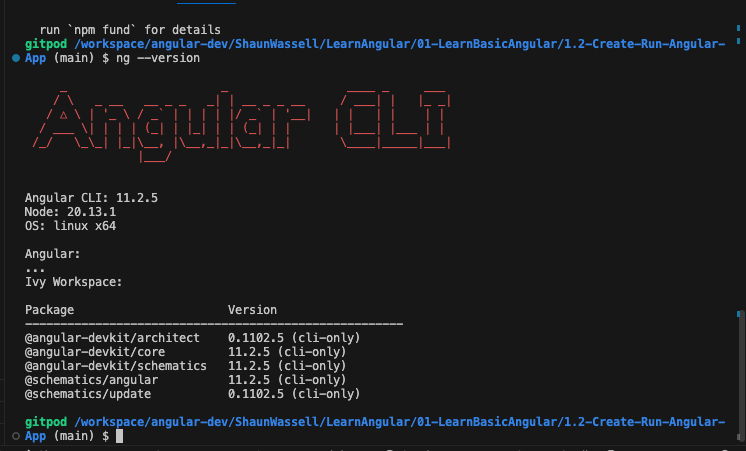
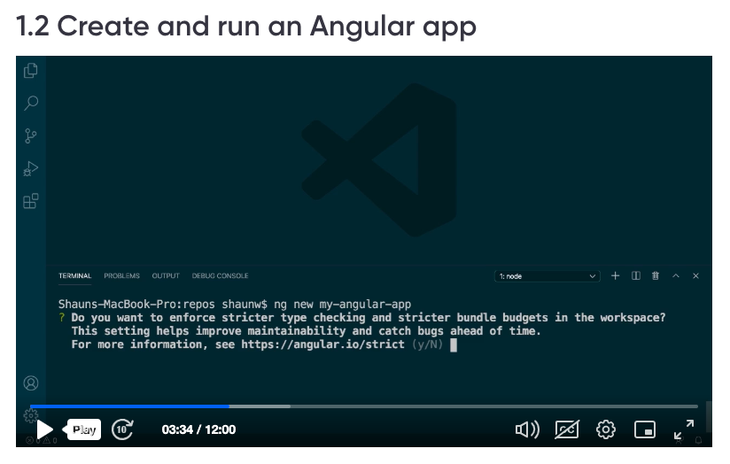

Angular CLI Tool to generate Angular Applications

Node is required to install NodeJS.
Use always LTS Version of NodeJS
Node Version is



Node Version should greater than 14.x
v14.15.1 
v6.14.8

Npm version should be greater than 6.x as displayed in screenshot

In order to install specific version of Node, one has to install nvm - node version manager
Step 1: Run the nvm installer
``` 
curl -o- https://raw.githubusercontent.com/nvm-sh/nvm/v0.39.1/install.sh | bash
```
Step 2:Update your profile configuration
```
export NVM_DIR="$([ -z "${XDG_CONFIG_HOME-}" ] && printf %s "${HOME}/.nvm" || printf %s "${XDG_CONFIG_HOME}/nvm")"
[ -s "$NVM_DIR/nvm.sh" ] && \. "$NVM_DIR/nvm.sh"
```
Step 3: 3. Reload the shell configuration
```
source ~/.bashrc
```
Step 4: Verify nvm 
```
nvm -v
```

Step 5: to install latest version

```
nvm install latest
```

Step 6: to install specific version of node

```
nvm install vX.Y.Z
nvm install v14.15.1
```


VSCode for Angular Development





To install angular, use following command
```
npm install -g @angular/cli
```
In order to check if angular is installed properly, use below command
```
ng --version
```
In order to install specific version of angular, use below command
```
npm install -g @angular/cli@11.2.5
```



To create an new angular app use below command
```
ng new my-angular-app
```


Do you need strict Mode : y

Would you like to add Angular routing? (y/N) : y
Which stylesheet format would you like to use? css 

