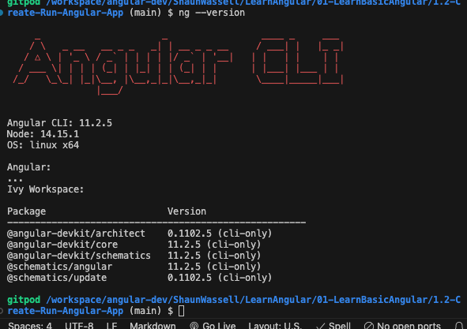
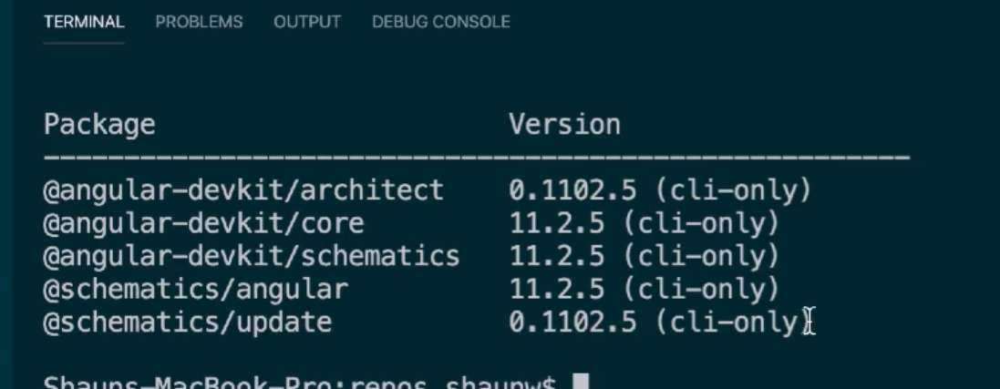
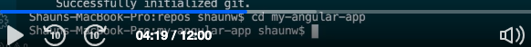
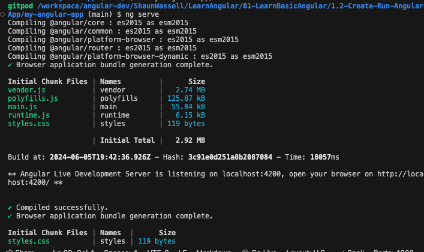
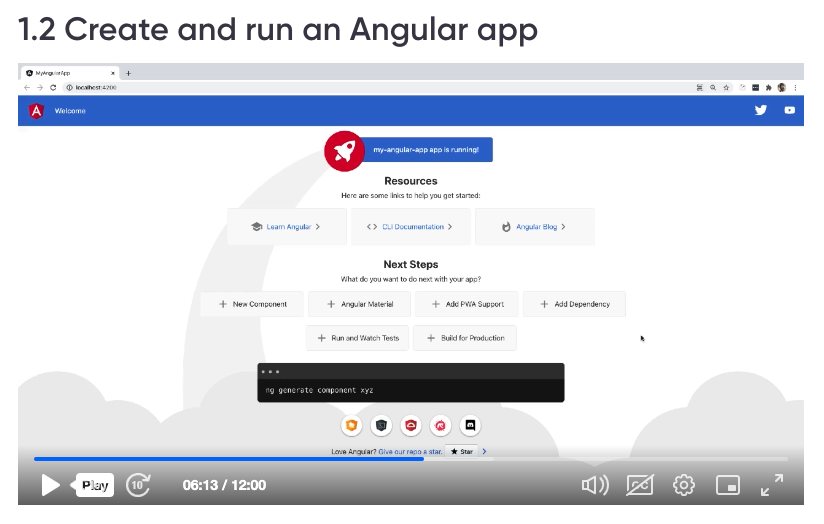
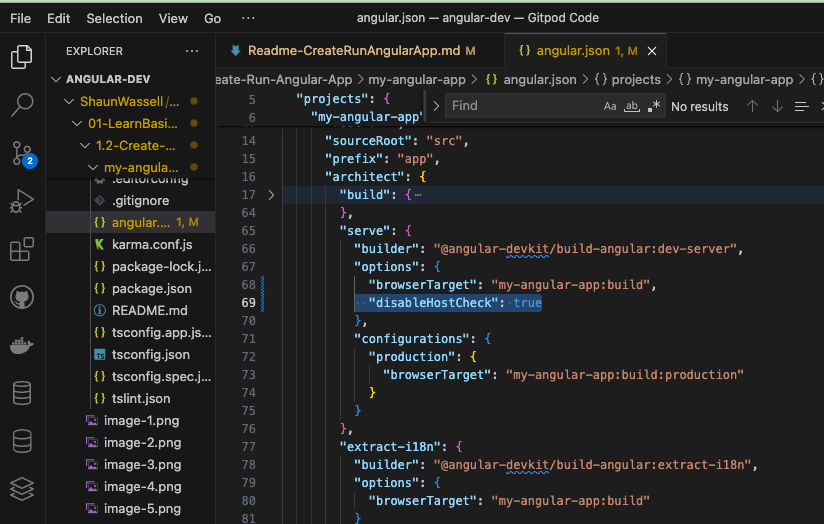

Angular CLI Tool to generate Angular Applications

Node is required to install NodeJS.
Use always LTS Version of NodeJS
Node Version is


Node Version should greater than 14.x
v14.15.1 
v6.14.8

Npm version should be greater than 6.x as displayed in screenshot

In order to install specific version of Node, one has to install nvm - node version manager
Step 1: Run the nvm installer
``` 
curl -o- https://raw.githubusercontent.com/nvm-sh/nvm/v0.39.1/install.sh | bash
```
Step 2:Update your profile configuration
```
export NVM_DIR="$([ -z "${XDG_CONFIG_HOME-}" ] && printf %s "${HOME}/.nvm" || printf %s "${XDG_CONFIG_HOME}/nvm")"
[ -s "$NVM_DIR/nvm.sh" ] && \. "$NVM_DIR/nvm.sh"
```
Step 3: 3. Reload the shell configuration
```
source ~/.bashrc
```
Step 4: Verify nvm 
```
nvm -v
```

Step 5: to install latest version

```
nvm install latest
```

Step 6: to install specific version of node

```
nvm install vX.Y.Z
nvm install v14.15.1
```


VSCode for Angular Development


To install angular, use following command
```
npm install -g @angular/cli
```
In order to check if angular is installed properly, use below command
```
ng --version
```
In order to install specific version of angular, use below command
```
npm install -g @angular/cli@11.2.5
```


To create an new angular app use below command
```
ng new my-angular-app
```


Do you need strict Mode : y

Would you like to add Angular routing? (y/N) : y
Which stylesheet format would you like to use? css 

Once the angular is installed, to verify he app, use command
```
ng --version
```
which will display the Angular Cli with installed components




Move into the directory where the app is created
```
cd  my-app



How to run angular app
```
ng serve
```




when you run from gitpod, one may get invalid host.
Please do following changes:

In angular.json, add the following under architect -> serve -> options

"disableHostCheck": true



Angular folder structure

e2e folder - end to end testing
src - main folder for all the components
src/app - where all the components are created
app-components
 app-routing.modules.ts
 app.component.css
 app.component.html
 app.component.spec.ts
 app.component.ts
 app.module.ts

 every component in angular as 3 different files
 app.component.ts - typescript file
 app.component.html - contains the dom structure of the component
 app.component.css - contains the component specific styling

app.component.spec.ts - test cases for the component
app-routing.modules.ts - will contain the routing logic

 app.module.ts - import a modules in to angular applications, we need to add the components
 
   
src/assets - where all the images are created
src/main.ts - where the angular applications start rendering
src/index.html - root div - where angular application is loaded
src/polyfills.ts - where any packages are installed for browser compatibility
src/styles.css - global styles
test.ts - all the test cases are maintained


