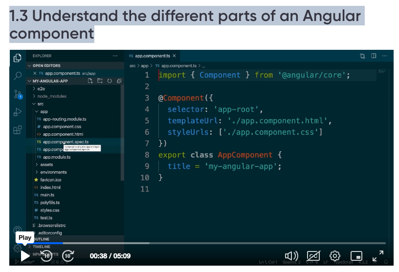
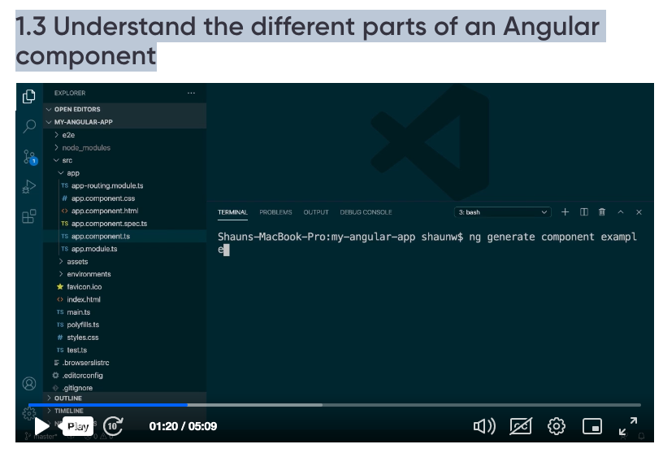
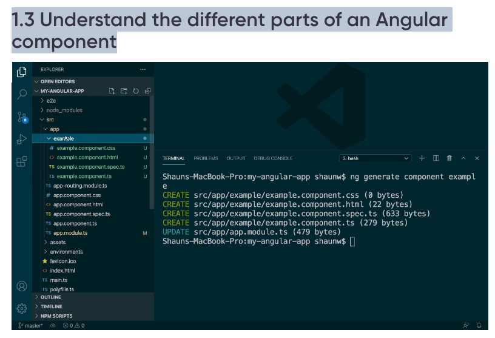
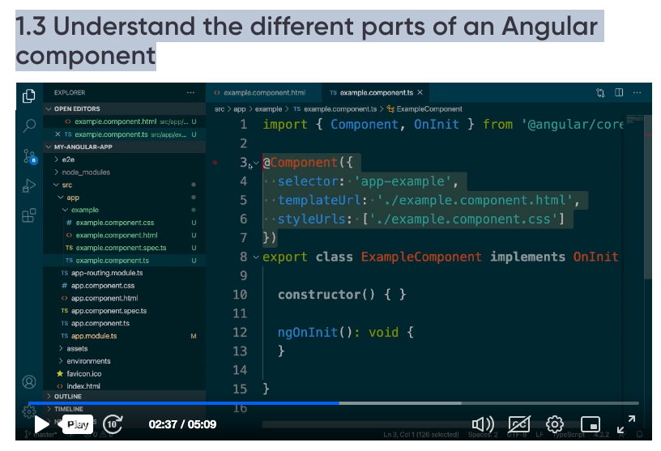
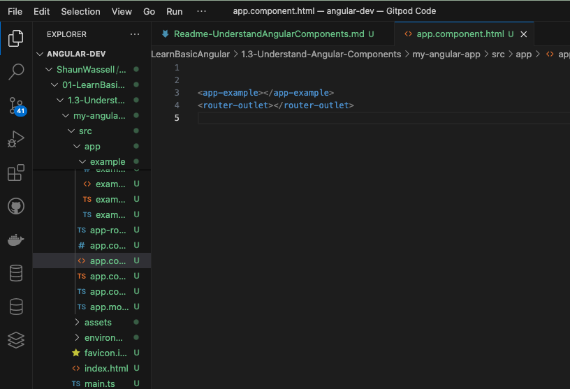

1.3 Understand the different parts of an Angular component


Note:
Created angular app using command
ng new my-angular-app


app.component.ts is the root component.




use angular cli to create components

```
ng generate component example
```
Output:
```
ng generate component example
CREATE src/app/example/example.component.css (0 bytes)
CREATE src/app/example/example.component.html (22 bytes)
CREATE src/app/example/example.component.spec.ts (633 bytes)
CREATE src/app/example/example.component.ts (279 bytes)
```



shortcut to generate component
```
ng g c example
```

example.component.ts file contains the angular meta data of the component
```
@Component({
  selector: 'app-example',
  templateUrl: './example.component.html',
  styleUrls: ['./example.component.css']
})
```


The selector is the reference name of the component
if one has to refer the component, use the selector value

for example if one wants to include example component in app component, 
open app.component.html 
removed all the content and only left out  router-outlet tag and added the app-example component as mentioned below
```
<app-example></app-example>
<router-outlet></router-outlet>
```



