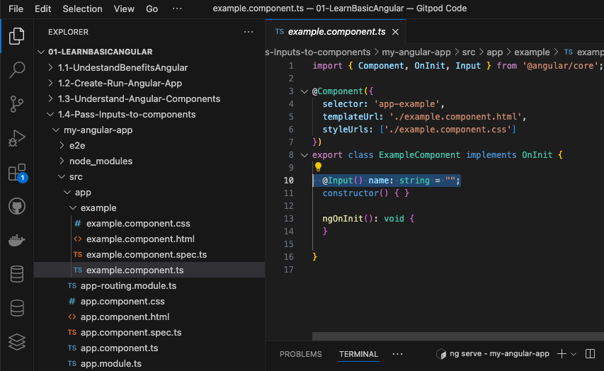
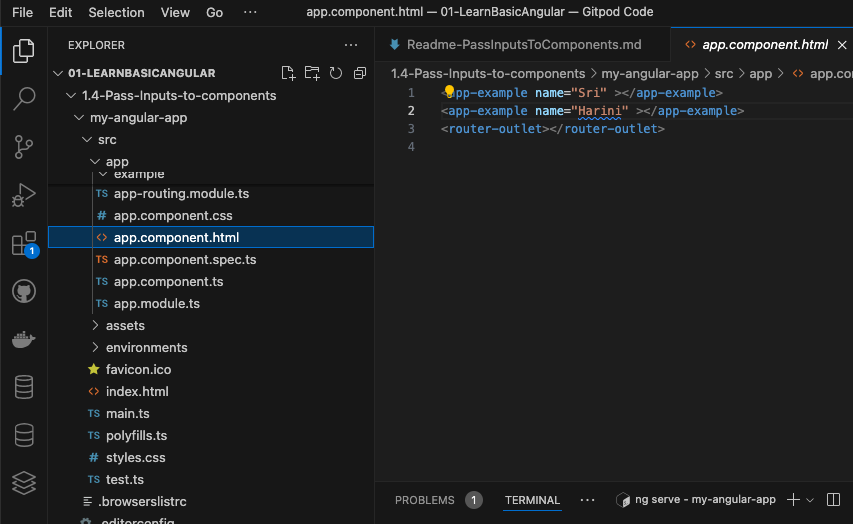

Adding Input to import statement
```
import { Component, OnInit, Input } from '@angular/core';
```
Added the property as attribute with in the example component class

```
  @Input() name: string = "";
```

pass the value from the to the component in main component where the example component is been referred
```
<app-example name="Sri" ></app-example>
<app-example name="Harini" ></app-example>
```


