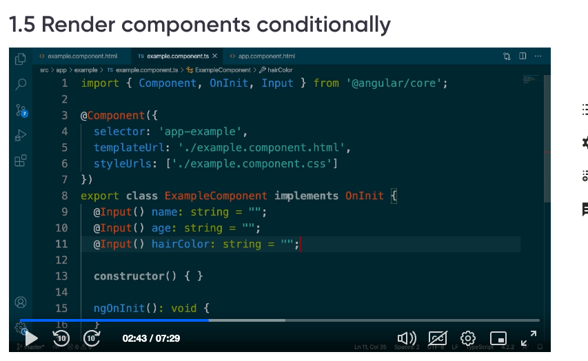

PreSteps
NodeJS 14.5.1
Angular 11
```
nvm use 14.15.1
```
To test the angular version
```
 ng --version
```
Step 1:
 ```
ng new my-angular-app
 ```

Step 2:
 ```
cd my-angular-app
 ```

modify angular.json
architect -> serve -> options ->
 ```
"disableHostCheck": true
 ```
Step 3: check of app is running or not
 ```
	ng serve 
 ```
Step 4: Modfy the main component
in app.component.html
 remove all the html code and only keep tag
 ```
 <router-outlet></router-outlet>
 ```
 ng generate component example

step 5: add properties to component
```
ng generate component example
```

Step 6: Modify example component add input example.component.ts
Step 6.1 add the attribute name property

``
import { Component, OnInit, Input} from '@angular/core';

@Component({
  selector: 'app-example',
  templateUrl: './example.component.html',
  styleUrls: ['./example.component.css']
})
export class ExampleComponent implements OnInit {

  @Input() name: string = "";
  constructor() { }

  ngOnInit(): void {
  }

}

```
Step 6.2 refer the component in app component (app.component.html)

```
<app-example. name ="Sri"></app-example>
<router-outlet></router-outlet>

```
Step 6.3 Modify in example.component.html
<p>example works!</p>
<p>it works {{name}}</p>

Step 7.00 Conditional Rendering


Structural Directives



Conditional Rendering

<p *ngIf="age"> Age:  {{age}}</p>
<p *ngIf="hairColor"> Hair color:  {{hairColor}}</p>


<h1 *ngIf="name; else noNameBlock"> Hello:{{name}} </h1>
<ng-template #noNameBlock>
    Hello ! <h1><i> no name is passed </i></h1>
</ng-template>