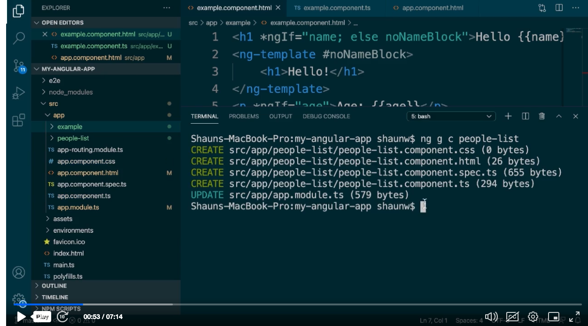
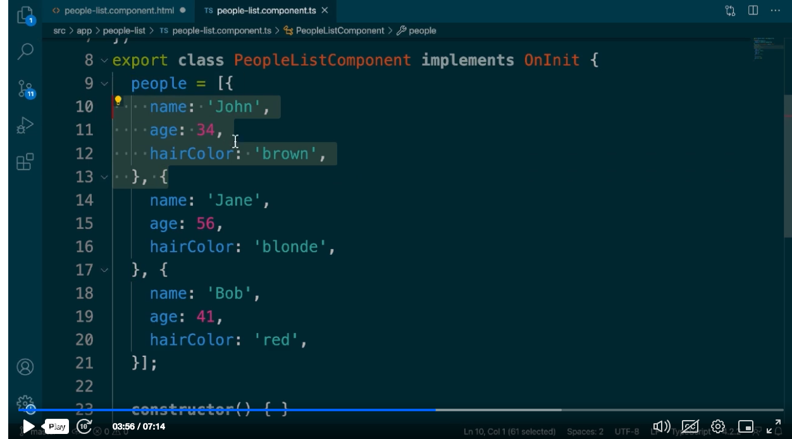

Generate new Component

```
ng g c people-list
```

adding the list of People Property Array in People list component
```
people = [
  {
    name: 'John',
    age: 34,
    hairColor: 'brown'
  },
  {
    name: 'Jane',
    age: 35,
    hairColor: 'blue'
  },{
    name: 'Bob',
    age: 50,
    hairColor: 'red'
  }
]
```


use 